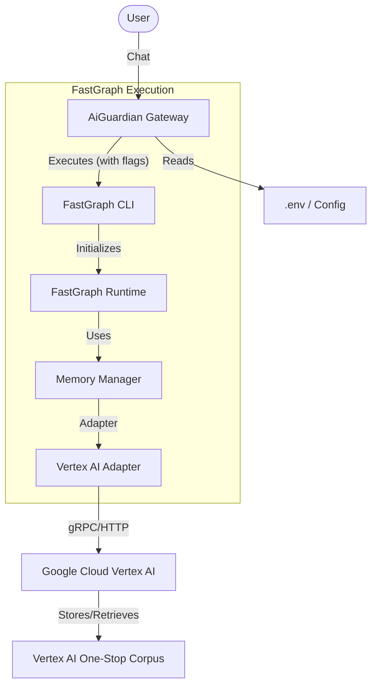

# Vertex AI Memory Integration Plan

## Goal
Enable Vertex AI-backed memory in the FastGraph execution.

## Conceptual Architecture

## Configuration & SDK Clarification

**1. Configuration Method:**
- The FastGraph CLI accepts configuration via **Command Line Flags** (e.g., `--memory-store=vertex`) and **Environment Variables**.
- While you mentioned a "configuration file", the current CLI documentation primarily points to flags. However, we will ensure the Gateway acts as the configuration provider by reading from `server/.env` and passing the correct arguments to the CLI.

**2. SDK Details:**
- **Google Cloud SDK**: This is the broader suite.
- **Vertex AI SDK (`cloud.google.com/go/vertexai`)**: This is the specific Go library we will use (as part of the Google Cloud SDK) if we need to perform direct corpus management in the Gateway.
- The **FastGraph CLI** has its own internal adapter that speaks to Vertex AI, relying on standard Google Cloud credentials (ADC).

## User Review Required
> [!IMPORTANT]
> **Vertex AI Credentials**: This plan relies on providing the `fastgraph` CLI with standard Google Cloud credentials (ADC) and specific environment variables (`VERTEX_PROJECT_ID`, `VERTEX_LOCATION`). Ensure the environment running the server has `gcloud auth application-default login` setup or `GOOGLE_APPLICATION_CREDENTIALS` set.

## Proposed Changes

### Server (`server`)

#### [MODIFY] [go.mod](file:///c:/Users/Antigravity/AiGuardian/server/go.mod)
- Add `cloud.google.com/go/vertexai` (and related genai) to `go.mod`.

#### [MODIFY] [main.go](file:///c:/Users/Antigravity/AiGuardian/server/main.go)
- Load new environment variables: `VERTEX_PROJECT_ID`, `VERTEX_LOCATION`, `VERTEX_CORPUS_NAME`.
- Configure `engine` with `MemoryConfig`.

#### [MODIFY] [server/pkg/fastgraph/runtime/engine.go](file:///c:/Users/Antigravity/AiGuardian/server/pkg/fastgraph/runtime/engine.go)
- Update `Run` method signature to accept `MemoryConfig`.
- Append CLI flags based on config:
    - `--memory-enabled`
    - `--memory-store=vertex`
- Inject environment variables into the subprocess:
    - `VERTEX_PROJECT_ID`
    - `VERTEX_LOCATION`
    - `VERTEX_CORPUS_NAME`

#### [MODIFY] [.env.example](file:///c:/Users/Antigravity/AiGuardian/server/.env.example)
- Add placeholder variables for Vertex AI.

## Verification Plan

### Manual Verification
1.  **Dry Run**:
    - Update `.env` with dummy Vertex values.
    - Run the server.
    - Trigger an agent.
    - **Verify** in server logs that the CLI command includes `--memory-enabled --memory-store=vertex`.
