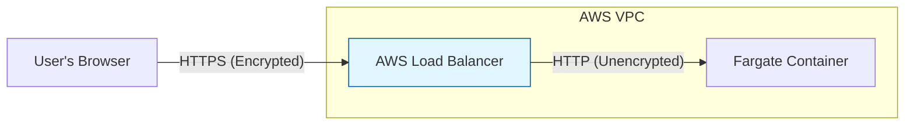

# Enabling HTTPS on AWS for FastGraph Gateway

You have two options for enabling HTTPS. **Option 1 (Load Balancer)** is highly recommended.

## Option 1: Application Load Balancer (Recommended)
This is the standard, easiest, and most secure way on AWS. The Load Balancer handles HTTPS (Termination), and talks to your container privately over HTTP (port 8080).

1.  **Request a Certificate**: Go to **AWS Certificate Manager (ACM)** and request a public certificate for your domain (e.g., `api.example.com`).
2.  **Create Target Group**:
    *   Type: IP addresses (for Fargate)
    *   Protocol: HTTP
    *   Port: 8080
3.  **Create Load Balancer (ALB)**:
    *   Scheme: Internet-facing
    *   **Listener**: Add HTTPS (Port 443).
    *   **Certificate**: Select the ACM cert you created in step 1.
    *   **Forward to**: The Target Group from step 2.
4.  **Update ECS Service**:
    *   Update your Service to use this Load Balancer.

**Why this is better:**
*   No need to manage cert files manually.
*   AWS handles auto-renewal.
*   No complex secret mounting needed.
*   The container stays simple (HTTP on 8080).

### Visual Explanation: "SSL Termination"



### Step-by-Step Detail

#### 1. The Target Group (The "Contact List")
Think of the Target Group as a dynamic list of IP addresses where your app is running.
*   **Type: IP**: Because Fargate gives each container its own private IP.
*   **Protocol: HTTP on 8080**: This tells the Load Balancer, "When you send traffic to these containers, just speak normal, unencrypted HTTP on port 8080." This is safe because it happens *inside* your private AWS network (VPC).

#### 2. The Load Balancer (The "Gatekeeper")
This is the server that sits at the edge of the internet and talks to users.
*   **Listener: HTTPS (443)**: This opens the secure door.
*   **Certificate**: You attach the AWS Certificate here. The Load Balancer uses this to decrypt the secret messages from the user.
*   **Forward to Target Group**: Once the message is decrypted and safe, the Load Balancer says, "Okay, I'll pass this request to one of the IPs in that list I have."

#### 3. ECS Service Update (The "Wiring")
You need to tell ECS: "Hey, when you spin up new containers, automatically register their IPs into that Target Group." This ensures the Load Balancer always knows where to send traffic, even if containers crash and restart.


## Option 2: Direct Container HTTPS (End-to-End Encryption)
Use this only if you rely on the code changes we just made (`RunTLS`) and require encryption *inside* the VPC between the connection and the container.

**The Challenge**:
Fargate containers are ephemeral. You cannot just "point" to a file on your laptop. The certificate files must exist **inside the running container**.

**How to do it:**

### A. Bake into Image (Simple but less secure)
1.  Put `cert.pem` and `key.pem` in a `certs/` folder in your project.
2.  Update `Dockerfile`:
    ```dockerfile
    COPY ./certs /app/certs
    ENV SSL_CERT_PATH=/app/certs/cert.pem
    ENV SSL_KEY_PATH=/app/certs/key.pem
    ```
3.  Rebuild and deploy: `./deploy.sh`

### B. Runtime Injection (Complex)
1.  Store the **Certificate Content** (the actual text) in AWS Secrets.
2.  Write a script (`entrypoint.sh`) that runs before your app starts:
    *   Reads the content from the Env Var.
    *   Writes it to a file e.g., `/tmp/cert.pem`.
    *   Starts the app with `SSL_CERT_PATH=/tmp/cert.pem`.

**Note:** The changes we made to `setup-aws.sh` push *Paths* to secrets. This only works for Option A or Local testing.
